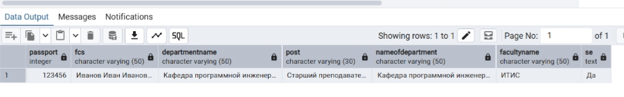
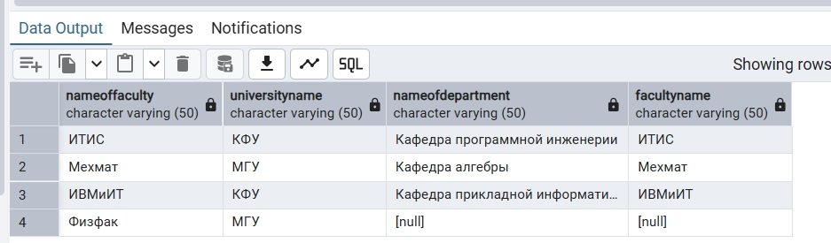
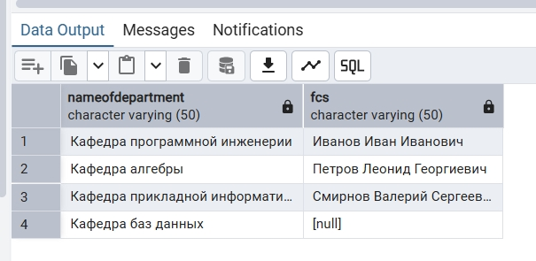
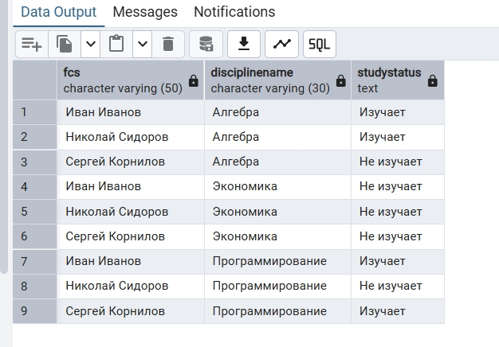

1. Выборка всех данных из таблицы

1. 1. Получить из таблицы teacher всех старших преподавателей ИТИС с дополнительной информацией о том, относится ли преподаватель к кафедре программной инженерии
```sql
SELECT *, 
       CASE
           WHEN department = 'Кафедра программной инженерии' THEN 'Да'
           ELSE 'Нет'
       END AS se
FROM teacher INNER JOIN department ON teacher.departmentname = department.nameofdepartment WHERE department.facultyname = 'ИТИС' AND teacher.post = 'Старший преподаватель';
```


1. 2. Получить все данные о факультетах и связанных с ними кафедрах, включая факультеты, у которых пока нет ни одной кафедры
```sql
SELECT * FROM faculty LEFT JOIN department ON faculty.nameoffaculty = department.facultyname;
```


2. Выборка отдельных столбцов

2. 1. Получить названия всех кафедр и ФИО работающих на них преподавателей, включая кафедры, за которыми пока не закреплён ни один преподаватель
```sql
SELECT department.nameofdepartment, teacher.FCs FROM teacher RIGHT JOIN department ON teacher.departmentname = department.nameofdepartment;
```


2. 2. Получить все возможные пары «студент — дисциплина» и для каждой пары вывести, изучает ли студент эту дисциплину
```sql
SELECT student.FCs, discipline.DisciplineName,
    CASE
        WHEN student_discipline.StudentID IS NOT NULL THEN 'Изучает'
        ELSE 'Не изучает'
    END AS StudyStatus
FROM student CROSS JOIN discipline LEFT JOIN student_discipline
    ON student.StudentID = student_discipline.StudentID AND discipline.DisciplineName = student_discipline.DisciplineName;
```
